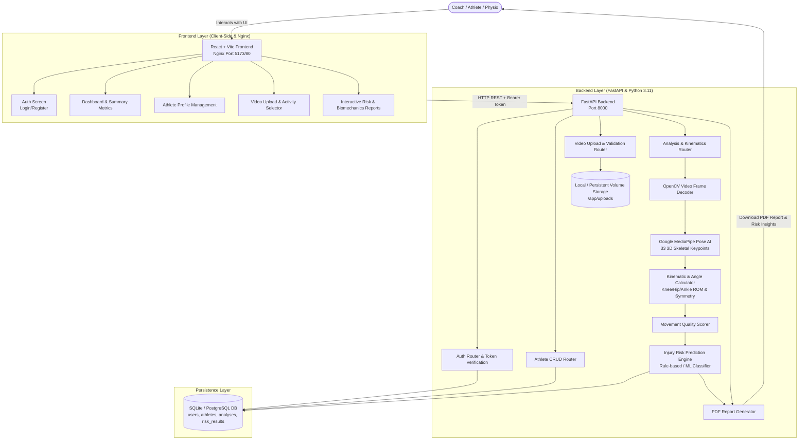
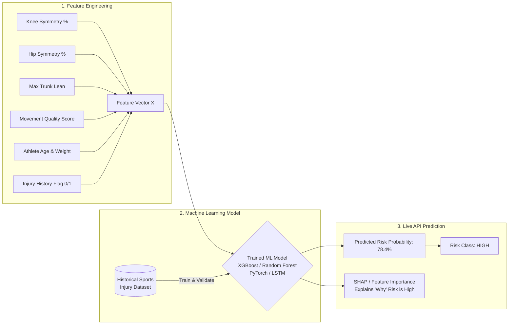
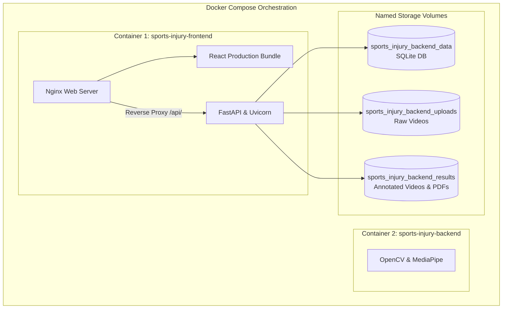

# Sports Injury Risk Detection and Prevention System
## Complete System Architecture, Tech Stack, Flowcharts & AI Roadmap

---

## 1. End-to-End System Architecture Diagram



---

## 2. Complete Tech Stack Breakdown

| Component Layer | Technology / Tool | Version | Role in the System | Why It Was Chosen |
| :--- | :--- | :--- | :--- | :--- |
| **Frontend Framework** | **React.js** | 18+ | Builds single-page user interface (SPA) | Component modularity, reactive state, fast rendering. |
| **Frontend Build Tool** | **Vite** | 5+ / 8+ | Bundler & local dev server | Instant hot module replacement (HMR), lightweight build output. |
| **Production Web Server** | **Nginx (Alpine)** | 1.25+ | Serves compiled static JS/CSS & reverse proxies API | High concurrency, low memory footprint (~15MB), SPA routing (`try_files`). |
| **Backend Framework** | **FastAPI** | 0.110+ | High-performance asynchronous REST API | Native OpenAPI Swagger documentation, async performance, Pydantic type validation. |
| **API Server (ASGI)** | **Uvicorn** | 0.29+ | ASGI web server runner | Lightning-fast Python server handling asynchronous requests. |
| **Computer Vision AI** | **MediaPipe** | 0.10.x | 33-point 3D skeletal landmark detector | Deep learning pose tracker running fast on CPU without needing dedicated GPUs. |
| **Video Processing** | **OpenCV (`cv2`)** | 4.9+ | Video decoding, frame sampling, visual stick-figure overlay | Industry standard for matrix manipulation and frame rendering. |
| **Numerical Math & Data** | **NumPy & Pandas** | 1.26+ / 2.1+ | Joint angle geometry, vectors, landmark time-series DataFrames | Vectorized trigonometric calculations and time-series aggregation. |
| **Database & ORM** | **SQLAlchemy + SQLite** | 2.0+ | Relational data persistence | DB-agnostic ORM (seamlessly switches from SQLite to PostgreSQL with zero code changes). |
| **Document Generation** | **ReportLab** | 4.1+ | PDF medical/coaching report generator | Automated generation of styled reports with scores, observations, and recommendations. |
| **Containerization** | **Docker & Docker Compose** | 24+ / v2 | Multi-container isolated environment | Replicable deployment eliminating *"works on my machine"* dependency errors. |

---

## 3. Step-by-Step Data Flow (What Happens Where & How)

### Step 1: Authentication & User Session
1. **Where:** `frontend/src/main.jsx` $\rightarrow$ `backend/app/routes/auth.py`
2. **How:** 
   - User enters email & password on React frontend.
   - Frontend calls `POST /api/auth/register` or `POST /api/auth/login`.
   - Backend hashes password with a unique salt (`hashlib.sha256`), stores it in SQLite, and returns a secure session token.
   - Frontend stores the token in `localStorage` and injects `Authorization: Bearer <token>` into all subsequent requests.

### Step 2: Athlete Profile Management
1. **Where:** `frontend/src/main.jsx` $\rightarrow$ `backend/app/routes/athletes.py` $\rightarrow$ SQLite DB
2. **How:**
   - Coach enters Athlete Name, Age, Height (cm), Weight (kg), Sport, and Prior Injury History.
   - Backend validates the schema using Pydantic (`AthleteCreate`), associates the record with `current_user.id`, and saves to the `athletes` table.

### Step 3: Video Ingestion & Validation
1. **Where:** `frontend/src/main.jsx` $\rightarrow$ `backend/app/routes/videos.py`
2. **How:**
   - User selects an athlete, chooses exercise activity (`squat`, `running`, `jumping_landing`), and uploads an MP4/MOV file.
   - Backend validates video size, extension, and headers, generates a unique UUID filename, and saves it to `/app/uploads/`.
   - Video metadata is saved to the `videos` database table.

### Step 4: Computer Vision & MediaPipe Pose Estimation
1. **Where:** `backend/app/services/video_processing.py` & `backend/app/services/pose_estimation.py`
2. **How:**
   - OpenCV opens the video stream (`cv2.VideoCapture`).
   - For every frame, MediaPipe's deep neural network detects **33 3D skeletal landmarks** (nose, shoulders, elbows, wrists, hips, knees, ankles, heels, toes).
   - Landmark coordinates $(x, y, z, \text{visibility})$ are structured into a time-series Pandas DataFrame.
   - OpenCV draws visual skeletal lines on each frame and saves an annotated video to `/app/results/`.

### Step 5: Kinematic Biomechanics Calculation
1. **Where:** `backend/app/services/biomechanics.py`
2. **How:**
   - Joint angles are computed across all frames using vector 3D trigonometry:
     $$\theta = \arccos\left(\frac{\vec{u} \cdot \vec{v}}{\|\vec{u}\| \|\vec{v}\|}\right)$$
   - Calculates:
     - **Left & Right Knee Range of Motion (ROM)** (Min/Max flexion angles).
     - **Left & Right Hip ROM**.
     - **Knee & Hip Bilateral Symmetry %**: Ratio comparing left vs. right joint trajectories.
     - **Trunk Lean Angle**: Angle of spine relative to vertical ground plane.
     - **Movement Consistency %**: Coefficient of variation across repetitions.

### Step 6: Injury Risk Prediction & Reporting
1. **Where:** `backend/app/services/risk_prediction.py` & `backend/app/services/report.py`
2. **How:**
   - Biomechanical outputs + Athlete baseline injury history are fed into the Risk Engine.
   - Calculates a normalized **0–100% Risk Score** and classifies into **LOW / MEDIUM / HIGH**.
   - Generates contextual clinical recommendations (e.g. glute strengthening, single-leg stability).
   - ReportLab compiles a structured PDF report ready for download.

---

## 4. Future AI/ML Roadmap: How to Predict Injury with Machine Learning (Milestone 3)

In Milestone 3, the current rule-based heuristic in `backend/app/services/risk_prediction.py` will be replaced by a **Supervised Machine Learning / Deep Learning model**.



### Proposed AI/ML Stack for Milestone 3:
1. **Model Frameworks:**
   - **XGBoost / LightGBM / Scikit-Learn:** Ideal for tabular kinematic feature vectors (knee angle, symmetry %, ROM, weight, age).
   - **PyTorch (LSTM / 1D-CNN / Transformers):** Ideal for raw temporal joint coordinate sequences across video time-series.
2. **Feature Extraction Pipeline:**
   ```python
   # Feature vector prepared from Milestone 2 outputs
   feature_vector = [
       biomechanics["knee_symmetry_pct"],
       biomechanics["hip_symmetry_pct"],
       biomechanics["trunk"]["max_lean_angle"],
       movement_quality["score"],
       athlete.age,
       athlete.weight_kg,
       1 if athlete.injury_history else 0
   ]
   ```
3. **Model Integration Point:**
   - Save the trained model to `backend/app/models/injury_model.pkl` (or `.onnx` / `.pt`).
   - Load once on backend startup:
     ```python
     import joblib
     MODEL = joblib.load("app/models/injury_model.pkl")
     
     def predict_injury(features):
         probability = MODEL.predict_proba([features])[0][1] * 100
         return probability
     ```

---

## 5. Docker Multi-Container Architecture


