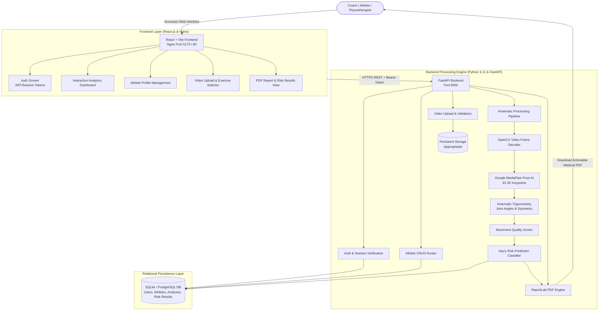
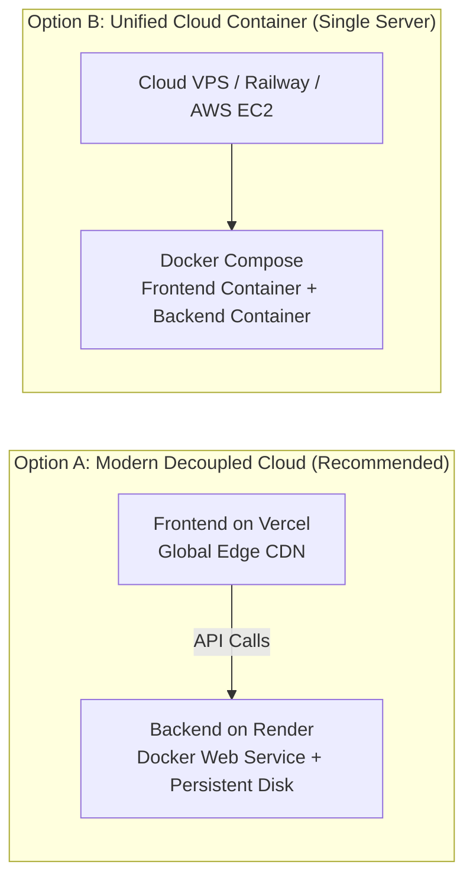
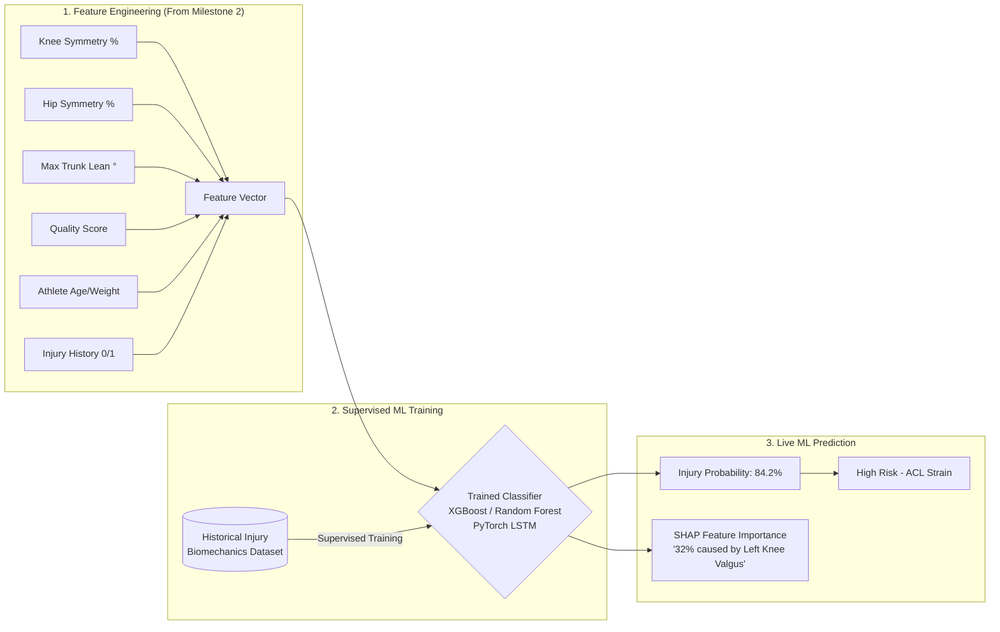

# Sports Injury Risk Detection and Prevention System
## Comprehensive Technical Architecture, Cloud Hosting, Detailed Workflow & AI Roadmap

---

## 1. Visual System Flowchart


---

## 2. Executive Overview & Value Proposition

The **Sports Injury Risk Detection and Prevention System** is an AI-powered computer vision and biomechanical screening platform. It converts standard smartphone or action camera videos into quantifiable 3D kinematic joint data without requiring wearable IMUs, markers, or motion-capture laboratories.

### Core Objectives:
1. **Sensorless Motion Analysis:** Uses Google MediaPipe to track 33 3D skeletal landmarks frame-by-frame.
2. **Kinematic Quantification:** Calculates joint flexion/extension angles, bilateral left-vs-right symmetry, trunk lean, and Range of Motion (ROM).
3. **Injury Risk Prediction:** Combines kinematic indicators with historical athlete profiles to identify high-risk non-contact injury patterns (e.g., ACL tear risk from knee valgus, spinal shear from excessive trunk lean).
4. **Preventive Interventions:** Automatically suggests targeted corrective exercises and generates clinical PDF reports for coaches, athletes, and physiotherapists.

---

## 3. End-to-End System Architecture



---

## 4. Complete Technology Stack Matrix

| Component | Technology | Version | System Function | Rationale / Trade-offs |
| :--- | :--- | :--- | :--- | :--- |
| **Frontend Framework** | **React.js** | 18.2+ | Single Page Application (SPA) | Component modularity, fast virtual DOM, state reactivity. |
| **Build & Bundler** | **Vite** | 5.x / 8.x | Frontend build tool | Sub-second Hot Module Replacement (HMR), optimized tree-shaken bundles. |
| **Production Web Server** | **Nginx** | Alpine | Static asset hosting & reverse proxy | Ultra-low memory usage (~15MB RAM), SPA fallback routing (`try_files`), gzip compression. |
| **Backend API** | **FastAPI** | 0.110+ | Asynchronous REST backend | High throughput, native OpenAPI Swagger UI (`/docs`), automated Pydantic schema validation. |
| **ASGI Server** | **Uvicorn** | 0.29+ | Asynchronous server runner | Lightning-fast asynchronous request handling with minimal latency. |
| **Computer Vision AI** | **MediaPipe** | 0.10.x | 33-point 3D skeletal landmark tracker | High accuracy, CPU-optimized deep learning inference without needing expensive dedicated GPUs. |
| **Video Processing** | **OpenCV (`cv2`)** | 4.9+ | Frame decoding & stick-figure drawing | Industry standard for pixel matrix manipulation and annotated video export. |
| **Math & Kinematics** | **NumPy & Pandas** | 1.26+ / 2.1+ | 3D vector geometry & time-series analysis | Vectorized trigonometric angle calculations and DataFrame aggregation. |
| **Database & ORM** | **SQLAlchemy + SQLite** | 2.0+ | Relational data persistence | Database-agnostic ORM (seamlessly transitions to PostgreSQL with zero code changes). |
| **PDF Generation** | **ReportLab** | 4.1+ | Automated clinical report builder | Pixel-perfect PDF compilation with styling, metrics tables, and recommendations. |
| **Containerization** | **Docker & Compose** | 24+ / v2 | Multi-service orchestration | Encapsulates all OS-level C++ video libraries and Python dependencies for 100% reproducibility. |

---

## 5. Cloud Hosting & Deployment Guide

This system is architected to support both decoupled serverless hosting and single-server containerized deployment:



### Deployment Options Comparison:

| Platform | Component | Setup Difficulty | Scalability | Cost | Best Used For |
| :--- | :--- | :--- | :--- | :--- | :--- |
| **Vercel** | Frontend (React UI) | ⭐ (1-Click) | Global Edge CDN | Free Tier Available | Zero-maintenance, blazing fast worldwide static asset distribution. |
| **Render** | Backend (FastAPI + Docker) | ⭐⭐ (Easy) | Auto-scaling instances | Free Tier Available | Easy Docker deployment with managed SSL and persistent storage disks. |
| **Railway** | Full Stack (Both Containers) | ⭐⭐ (Easy) | Container orchestration | Usage-based | Instant GitHub auto-deploy with shared internal Docker networking. |
| **AWS (ECS / EC2)** | Full Stack / Microservices | ⭐⭐⭐⭐ (Advanced) | Enterprise high availability | Pay-as-you-go | Large-scale sports organizations, multi-tenant hospital/clinic rollouts. |
| **DigitalOcean / Linode** | Full Stack (Docker Compose) | ⭐⭐⭐ (Moderate) | Single VPS instance | ~$6 - $12 / mo | Simple, predictable cost for development and staging environments. |

---

## 6. In-Depth Step-by-Step User & Data Processing Workflow

```
[Phase 1: User Auth] ──► [Phase 2: Athlete Profile] ──► [Phase 3: Video Ingestion]
                                                                  │
[Phase 6: Risk Prediction] ◄── [Phase 5: Biomechanics] ◄── [Phase 4: MediaPipe Tracking]
       │
[Phase 7: Dashboard Visualization & PDF Report Export]
```

### Phase 1: User Registration & Session Security
* **User Action:** Coach/Physio visits the web portal and creates an account or logs in.
* **Backend Processing:**
  - Password is encrypted with a unique salt using `hashlib.sha256`.
  - A secure UUID session token is created and persisted in the SQLite `sessions` table.
  - The token is passed to the browser and stored in `localStorage`.
  - All subsequent API requests automatically include the `Authorization: Bearer <token>` header.

### Phase 2: Athlete Profile & Risk Baseline Creation
* **User Action:** User navigates to the **Athletes** tab and enters:
  - Name, Sport (e.g. Basketball, Soccer, Sprinting), Age, Height (cm), Weight (kg), and Prior Injury History (e.g. *'ACL reconstruction left knee (2023)'*).
* **Backend Processing:**
  - Validated by Pydantic schema (`AthleteCreate`).
  - Saved to the relational `athletes` table linked to the current user ID.

### Phase 3: Video Ingestion & Structural Validation
* **User Action:** In the **Video Analysis** tab, user selects the athlete, chooses the activity type (`squat`, `running`, `jumping_landing`), and uploads an action video (MP4, MOV, AVI).
* **Backend Processing:**
  - Checks MIME types, magic numbers, and file extensions.
  - Generates a UUID filename to prevent collisions and saves the raw video in `/app/uploads/`.
  - Records an entry in the `videos` table with status `uploaded`.

### Phase 4: Computer Vision AI & 33-Landmark Pose Estimation
* **Backend Processing:**
  - OpenCV opens the video stream (`cv2.VideoCapture`) and extracts frames.
  - Google MediaPipe Pose deep neural network scans every frame:
    - Identifies **33 3D skeletal landmarks** (Shoulders, Elbows, Wrists, Pelvis, Knees, Ankles, Heels, Toes).
    - Captures coordinates: $(X, Y, Z)$ normalized + visibility confidence scores.
  - Generates an **Annotated Video Overlay** with a rendered visual skeleton for visual movement inspection.

### Phase 5: Biomechanical Kinematic Calculations
* **Backend Processing:**
  - Joint angles are computed across all frames using 3D vector dot products:
    $$\theta = \arccos\left(\frac{\vec{u} \cdot \vec{v}}{\|\vec{u}\| \|\vec{v}\|}\right)$$
  - Computes:
    1. **Knee Range of Motion (ROM):** Maximum and minimum flexion/extension degrees.
    2. **Bilateral Symmetry Deficit (%):** Compares left knee vs. right knee angle curves during loading.
    3. **Trunk Lean Angle:** Measures forward/lateral spinal lean relative to vertical ground gravity.
    4. **Movement Consistency (%):** Variance of mechanics across repeated cycles.

### Phase 6: Injury Risk Prediction & Clinical Scoring
* **Backend Processing:**
  - Combines Kinematic Data + Physical Profile + Prior Injury History into a weighted model:
    - **Symmetry Deficit (25% weight):** Bilateral load imbalances.
    - **Movement Quality (25% weight):** Range of motion & smoothness.
    - **Trunk Lean (20% weight):** Spinal shear force risk.
    - **Consistency (15% weight):** Movement degradation / fatigue.
    - **Injury History (15% weight):** Prior vulnerability weighting.
  - Outputs a **0–100% Risk Score** and classifies into:
    - **LOW RISK (0–33%):** Symmetrical, safe movement patterns.
    - **MEDIUM RISK (34–66%):** Noticeable joint asymmetry or previous injury compensations.
    - **HIGH RISK (67–100%):** Severe biomechanical flaws (e.g. knee valgus collapse, landing instability).

### Phase 7: Interactive Dashboard & PDF Report Generation
* **User Action & System Output:**
  - Results appear in the **Dashboard** and **Results** tables in real-time.
  - A formal medical PDF report is dynamically compiled via ReportLab (`/api/reports/{id}`) containing:
    - Athlete Bio & Sport Demographics.
    - Risk Gauge Score & Categorization.
    - Detailed Joint Kinematics Breakdown.
    - Actionable Corrective Exercises (e.g. *'Single-leg stability drills & glute medius strengthening'*).

---

## 7. Key System Statistics & Technical Benchmarks

| Metric / Benchmark | Value / Performance | Description |
| :--- | :--- | :--- |
| **Pose Tracking Accuracy** | 33 3D Keypoints | Covers full lower-body, upper-body, and head landmarks. |
| **Frame Processing Speed** | 25 – 45 FPS (CPU) | Real-time / near-real-time CPU execution without GPU dependency. |
| **Video Resolution Support** | 720p / 1080p / 4K | Automatically resized and standardized during frame decoding. |
| **API Response Latency** | < 45 ms (Standard CRUD) | Asynchronous FastAPI endpoints. |
| **Docker Footprint** | ~350 MB (Compressed) | Optimized multi-stage Docker builds. |
| **Supported File Formats** | MP4, MOV, AVI, MKV, WebM | Full cross-platform video container support. |

---

## 8. Future AI/ML Roadmap (Milestone 3 Supervised Learning)



### How to Train and Predict Injury Risk with AI:
1. **Feature Vector:** Each video analysis produces a 10-dimensional numerical vector representing kinematic geometry.
2. **Model Training:** Train an **XGBoost Classifier** or **Random Forest** on historical athlete injury datasets to map kinematic vectors to binary injury outcomes (1 = Injured within season, 0 = Healthy).
3. **Deep Learning Option (Temporal):** Feed raw frame-by-frame joint angle time-series into a **PyTorch LSTM / 1D-CNN** to capture dynamic momentum shifts during cutting and landing.
4. **Integration Point:** Save the model as `injury_model.pkl` in `backend/app/models/` and call `model.predict_proba()` inside `risk_prediction.py`.
